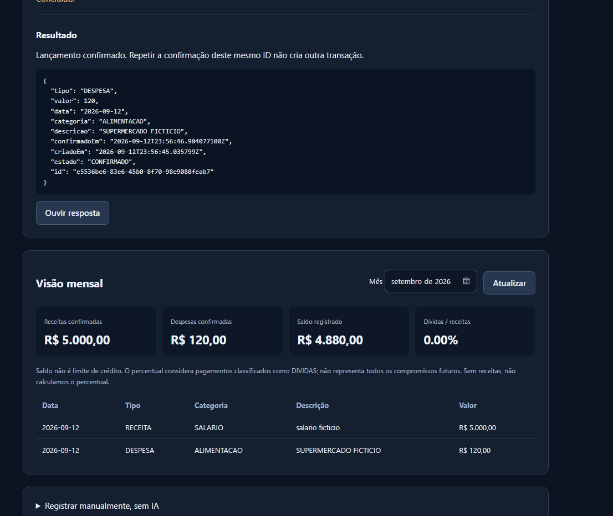

# CrediFlow AI

Assistente educacional de fluxo de caixa com comandos de texto e voz, desenvolvido com Spring Boot, Spring AI e modelos locais. A evolução orientada à área de crédito e dados combina lançamentos fictícios, resumo mensal e um indicador descritivo de pagamentos de dívidas sobre receitas. Esses indicadores não medem, sozinhos, a capacidade de pagamento nem substituem um motor de decisão de crédito.

> **Importante:** esta é uma aplicação local e educacional. Ela não acessa bancos, CPF, senhas ou contas reais; não consulta bureaus; não calcula score, PD, limite ou aprovação de crédito. Use somente dados fictícios e não disponibilize a aplicação na internet.

## O que o projeto faz

- Recebe comandos em português e usa o Ollama local para interpretar a intenção.
- Registra receitas e despesas como rascunhos, exigindo confirmação explícita antes de alterar o saldo.
- Consulta resumo mensal e despesas por categoria por meio de uma ferramenta real da aplicação.
- Persiste rascunhos e lançamentos confirmados em H2 local; somente os confirmados entram no saldo e na listagem mensal.
- Calcula receitas, despesas, saldo e o percentual de pagamentos classificados como `DIVIDAS` sobre receitas.
- Oferece interface web, API REST, transcrição local com Whisper e síntese de voz pelo SAPI do Windows.
- Não envia prompts, transcrições ou áudios para APIs pagas ou serviços de nuvem.

## Arquitetura

```text
Navegador / REST
       |
       +--> AssistenteService --> ChatClient --> Ollama (qwen3:4b local)
       |                             |
       |                             +--> prepararLancamento (rascunho)
       |                             +--> consultarResumoMensal
       |                             +--> solicitarEsclarecimento
       |
       +--> FluxoCaixaService --> LancamentoRepository --> H2 local
       |
       +--> AudioService ------> adaptador Python local
                                      +--> faster-whisper (transcrição)
                                      +--> Windows SAPI (voz)
```

O Spring AI apresenta ferramentas ao modelo e executa as chamadas que ele solicita. O código valida os dados, calcula os totais e cria rascunhos. Se a chamada ao modelo terminar sem resultado de ferramenta, o `AssistenteService` tenta reconhecer um comando estruturado e usa as mesmas funções de negócio. Esse reconhecimento auxiliar é baseado em regras, não em IA. Se houver um resultado de esclarecimento, ele é preservado; o reconhecimento auxiliar também não substitui uma conexão indisponível com o Ollama. A resposta pública é construída pelo código a partir do resultado das ferramentas.

## Requisitos

- Java 21 ou superior.
- Maven Wrapper incluído (`mvnw.cmd`).
- Python 3.10 ou superior para o módulo de áudio.
- Ollama instalado e em execução.
- Modelo local `qwen3:4b` para interpretação e Tool Calling.
- Windows com uma voz SAPI instalada em português para síntese local.

Não é necessário cartão, chave de API, OpenAI, Docker ou assinatura paga.

## Preparação do Ollama

```powershell
ollama pull qwen3:4b
ollama list
```

O serviço local deve responder em `http://127.0.0.1:11434`. Para verificar:

```powershell
Invoke-RestMethod http://127.0.0.1:11434/api/version
```

## Executar a API

Na raiz do projeto, onde estão `pom.xml` e `mvnw.cmd`:

```powershell
.\mvnw.cmd test
.\mvnw.cmd spring-boot:run
```

A API fica em `http://127.0.0.1:8081`. A porta é configurada em `src/main/resources/application.properties` para evitar conflito com outros projetos locais.

Para consultar o estado:

```powershell
Invoke-RestMethod http://127.0.0.1:8081/api/status | ConvertTo-Json
Invoke-RestMethod http://127.0.0.1:8081/api/ia/diagnostico | ConvertTo-Json
```

Abra `http://127.0.0.1:8081` para usar a interface.

## Executar o adaptador de áudio

Em um segundo PowerShell, na raiz do projeto:

```powershell
py -m venv .venv
.\.venv\Scripts\python.exe -m pip install -r audio\requirements.txt
.\.venv\Scripts\python.exe audio\servidor.py --baixar-modelo
.\.venv\Scripts\python.exe audio\servidor.py
```

O comando com `--baixar-modelo` baixa o modelo público Whisper `base` uma única vez. As próximas execuções usam os arquivos em `audio/modelos/`, que são ignorados pelo Git. O servidor de áudio escuta somente `http://127.0.0.1:8008`.

Se o SAPI não puder ser criado na sessão atual, a API ainda retorna a resposta em texto e informa que a síntese de voz está indisponível. A transcrição e a síntese são módulos opcionais para permitir o desenvolvimento e os testes sem interromper os cálculos de negócio.

## Fluxo recomendado

1. Inicie o Ollama.
2. Inicie o adaptador de áudio, se for testar voz.
3. Inicie a API Java.
4. Abra a interface web.
5. Use um comando como `Consulte o resumo de setembro de 2026.`.
6. Para registrar algo, use um comando com os campos explícitos: `Quero registrar uma RECEITA de 5000.00 reais. Data: 2026-09-12. Categoria: SALARIO. Descricao: salario ficticio.`. Datas no formato brasileiro `12/09/2026` e faladas como `12 de setembro de 2026`, `12 de 9 de 2026` ou `12 de nove de 2026` também são aceitas; confira sempre a transcrição antes de confirmar.
7. Confira o rascunho e clique em **Confirmar lançamento**.
8. Atualize o mês e verifique que o saldo só mudou depois da confirmação.

Para voz, um exemplo é: “Quero registrar uma despesa de 80 reais. Data: 12 de setembro de 2026. Categoria: alimentação. Descrição: café fictício.” O reconhecimento de datas também aceita o mês como `9` ou `nove`. A transcrição pode errar um ano ou valor; confira o rascunho completo. O programa preserva o ano informado, sem trocar automaticamente `2006` por `2026`.

## Endpoints principais

| Método | Endpoint | Finalidade |
|---|---|---|
| GET | `/api/status` | Estado da API |
| GET | `/api/ia/diagnostico` | Testa Spring AI + Ollama |
| POST | `/api/assistente/texto` | Interpreta um comando textual |
| POST | `/api/assistente/audio` | Transcreve, interpreta e tenta gerar voz |
| POST | `/api/lancamentos/rascunhos` | Prepara lançamento manual |
| POST | `/api/lancamentos/{id}/confirmar` | Confirma um lançamento |
| GET | `/api/lancamentos?mes=AAAA-MM` | Lista confirmados do mês |
| GET | `/api/resumo?mes=AAAA-MM` | Calcula indicadores do mês |
| POST | `/api/audio/transcricao` | Transcrição local isolada |
| POST | `/api/audio/voz` | Síntese local isolada |

Exemplo textual:

```powershell
$body = @{ texto = "Consulte o resumo de setembro de 2026." } | ConvertTo-Json
Invoke-RestMethod `
  -Uri http://127.0.0.1:8081/api/assistente/texto `
  -Method Post -ContentType application/json -Body $body | ConvertTo-Json -Depth 8
```

Exemplo de lançamento manual:

```powershell
$body = @{
  tipo = "RECEITA"
  valor = 5000.00
  data = "2026-09-12"
  categoria = "SALARIO"
  descricao = "Salario ficticio"
} | ConvertTo-Json

$rascunho = Invoke-RestMethod `
  -Uri http://127.0.0.1:8081/api/lancamentos/rascunhos `
  -Method Post -ContentType application/json -Body $body

Invoke-RestMethod `
  -Uri ("http://127.0.0.1:8081/api/lancamentos/{0}/confirmar" -f $rascunho.id) `
  -Method Post | ConvertTo-Json -Depth 5
```

## Testes e qualidade

```powershell
.\mvnw.cmd test
```

Na execução local de 13/09/2026, os relatórios registraram **12 testes, 0 falhas, 0 erros e 0 ignorados**. Eles cobrem o contexto Spring e regras de negócio: confirmação, idempotência do mesmo ID, meses, categorias, pagamentos de dívidas sobre receitas, valores monetários com `BigDecimal`, tipos inválidos, valores fora do limite e IDs inexistentes. Os testes usam H2 em memória e não acessam o banco de demonstração.

Essa suíte não valida a qualidade da transcrição, todas as formas de fala nem o comportamento do modelo. Os testes manuais, capturas e limitações estão em [Evidências e evolução](docs/02-evidencias-evolucao.md).

Confirmar duas vezes o mesmo ID não duplica a transação. Enviar novamente o mesmo comando, porém, pode criar outro rascunho. Os cálculos usam valores validados e confirmados; conferir valores e datas extraídos continua sendo necessário.

## Demonstração

No cenário fictício registrado nas capturas, foram confirmados R$ 5.000,00 de receita e R$ 120,00 de despesa, com saldo de R$ 4.880,00.



Veja também a [consulta textual do resumo](evidencias/04-resumo-textual.png), o [diagnóstico local](evidencias/02-ia-local.png) e os [relatórios de testes](evidencias/testes/FluxoCaixaTests.txt).

## Limites e próximos passos

O indicador `pagamentosDividas / receitas` é apenas uma sinalização educacional. Ele não inclui automaticamente todos os compromissos futuros e não deve ser interpretado como score, capacidade aprovada ou limite. Não há autenticação, autorização ou multiusuário; por isso, o servidor deve permanecer em localhost.

O modelo local pode pedir esclarecimento mesmo com os dados presentes. O reconhecimento por regras cobre formatos específicos e não garante compreensão de qualquer frase, de múltiplos lançamentos ou de valores por extenso. Existe um formulário manual para os casos não reconhecidos. Não há deduplicação entre comandos diferentes, edição/exclusão de lançamentos pela interface ou histórico de conversas. Uma correção após confirmar exige uma evolução própria do projeto.

Evoluções possíveis: exportação CSV para análise em Python, consultas SQL de carteira sintética, monitoramento de categorias e integração posterior com o CrediPolicy por contrato explícito. Spark/Databricks só devem entrar quando houver volume ou uma etapa analítica que justifique seu uso.

## Tecnologias

Java 21 · Spring Boot 4.1.1 · Spring AI 2.0.1 · Ollama · Qwen3 4B · Spring Data JPA · H2 · Maven · Python · faster-whisper · Windows SAPI · HTML/CSS/JavaScript.

## Aprendizados

O projeto demonstra como separar interpretação de linguagem, execução de ferramentas, validação, persistência e cálculo de indicadores. A confirmação explícita e os limites locais foram adotados para reduzir duplicidade, exposição de dados e respostas não verificadas — princípios importantes em sistemas de crédito e dados.
